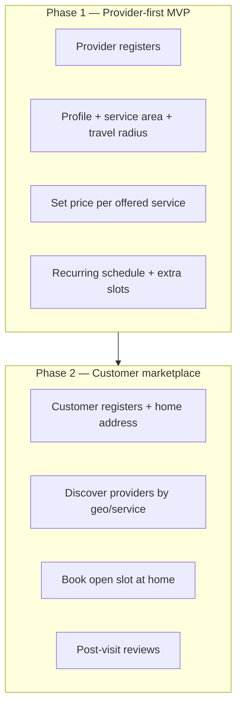
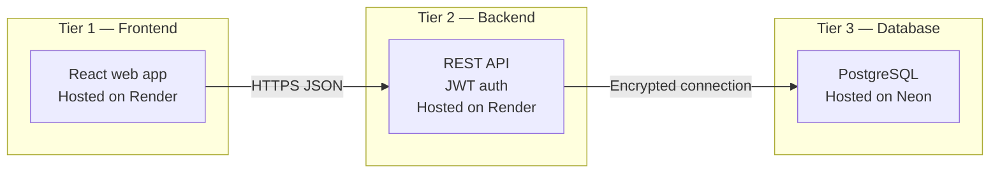
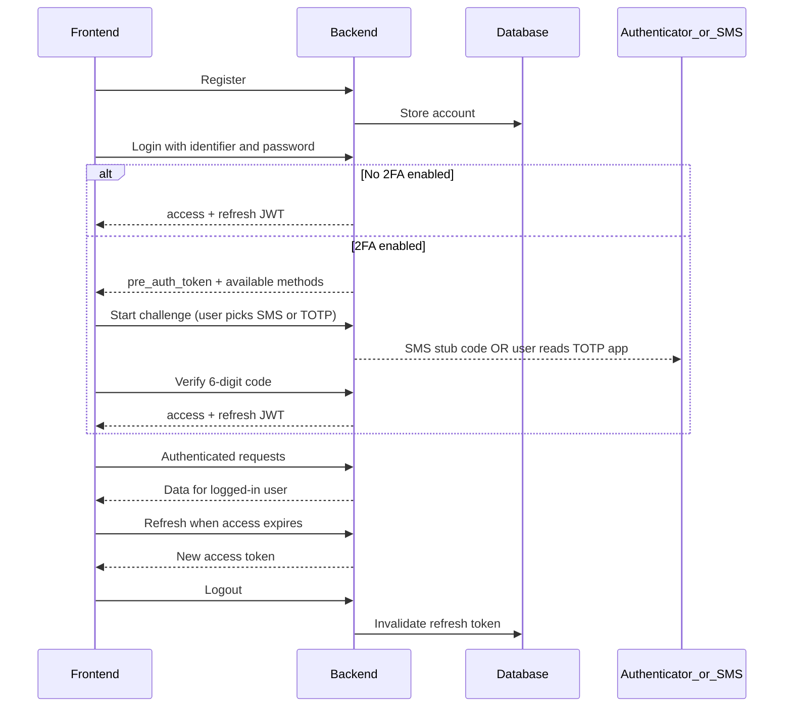
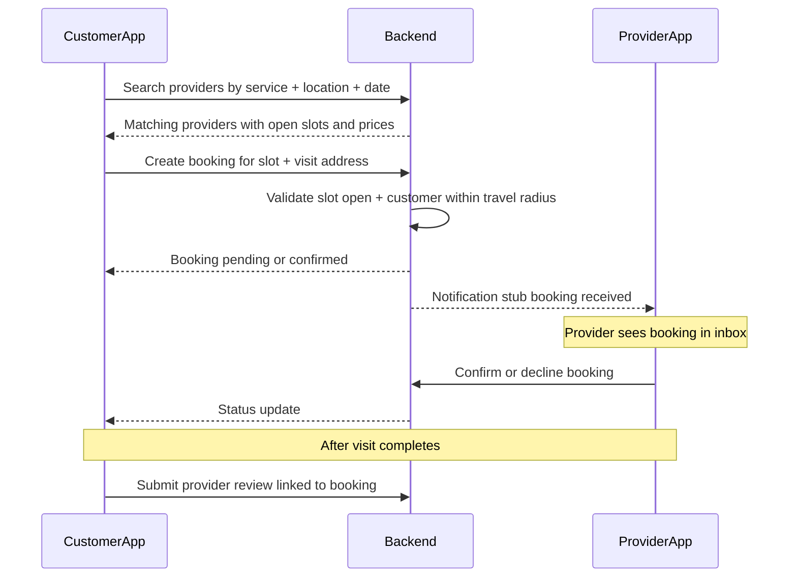
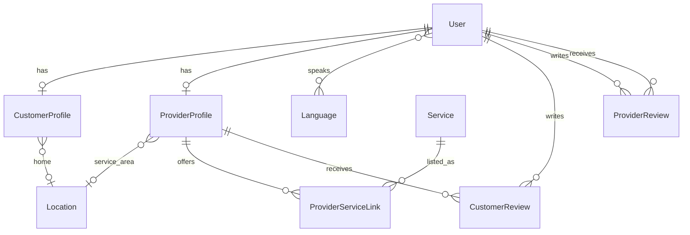
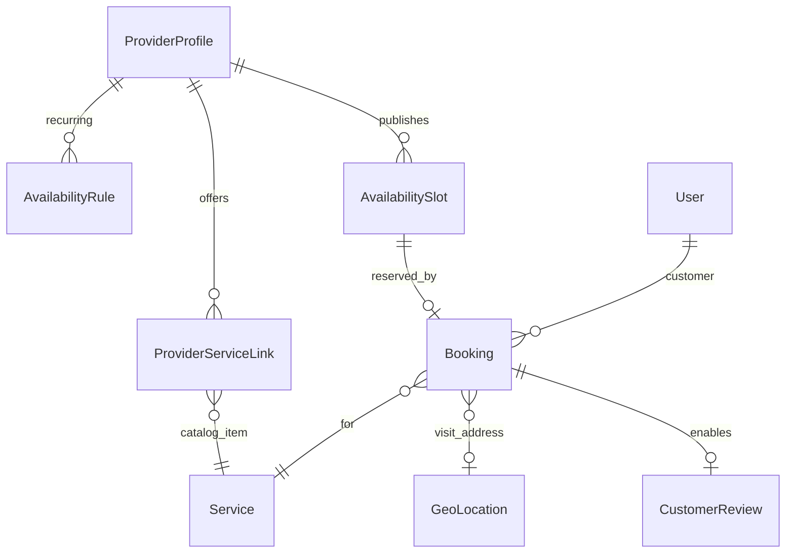

# BitHealth — System Requirements & Design

**BitHealth** is a marketplace where therapists and medical service providers submit **availability slots**, **price ranges**, and **travel availability**; customers and patients discover them and book **home visits at their own domicile**.

This document describes **what** the system must do and **how the major pieces connect**. It is a design reference for product and engineering—not a code-level specification.

| Side | Gets |
|------|------|
| **Provider** | Public profile, per-service pricing, travel radius, recurring + ad-hoc availability, booking inbox (phase 2) |
| **Customer** | Search by location, service, and language; view open slots; book at home address (phase 2) |

**Frontend note:** The existing React app is **not yet aligned** with this product—a colleague is adapting it. This document describes the **target marketplace UX**, not the current companion-style prototype.

---

## 1. Product summary

| Actor | Role |
|--------|------|
| **Provider** | Therapist or medical service worker; sets services, prices, travel radius, and availability; receives bookings (phase 2). |
| **Customer** | Patient or family member; discovers providers, books home visits, reviews after completed visits (phase 2). |

Delivery is split into two phases. **Phase 1 (provider-first MVP)** ships first; customer booking follows in **Phase 2**.



**Phase 1 success criteria:** A provider can sign up, configure offerings, publish availability (recurring rules and one-off slots), and see their schedule in the app—without customer booking yet.

**Phase 2 success criteria:** A customer can find a provider within travel range, pick a slot, and complete a booking lifecycle (request → confirm → complete → review).

**Core flows**

| Phase | Flow |
|-------|------|
| **1** | Provider registers → completes public profile → sets service area and **travel radius (km)** → links catalog services with **their own price** → defines **recurring weekly availability** and **ad-hoc open slots** → views schedule dashboard |
| **2** | Customer registers → sets home address → browses/filters providers by service, language, and distance → picks an open slot → confirms visit at home → after visit, rates provider (provider may rate customer) |

---

## 2. Three-tier architecture



| Tier | Purpose | Hosting |
|------|---------|---------|
| **Frontend** | Accessible UI for customers and providers | Render (static SPA) |
| **Backend** | Business logic, auth, API | Render |
| **Database** | Persistent relational storage | Neon |

**Communication principles**

- The browser talks to the API **only over HTTPS** using **JSON**.
- Authentication is **token-based** (short-lived access token + long-lived refresh token); the API does not rely on server-rendered pages for the app UI.
- The database is **never** reachable from the client; only the backend holds connection credentials.
- Marketplace writes (availability, bookings) require **strong consistency** on PostgreSQL; catalog browse can stay read-heavy.

---

## 3. How frontend and backend work together

### 3.1 Environments

| Environment | Frontend | API |
|-------------|----------|-----|
| Local development | Typical Vite dev port | Local API port |
| Production | Render frontend URL | Render backend URL |

The backend must explicitly allow the frontend origin for cross-origin requests. The frontend should use a single configured API base URL for all calls.

**Current state:** The frontend runs on **mock data** and is being reworked for the marketplace. The backend has auth, 2FA, and read-only catalog APIs ready for integration.

### 3.2 Authentication (design)

**Swagger groups:** `auth` (register, login, JWT) and `2FA-auth` (two-factor setup, challenge, password reset).



| Concern | Design choice |
|---------|----------------|
| Login identifier | **Email**, **phone number**, or **CNP/SSN** — single field `identifier` + `password` |
| Phone format | Whitespace stripped on save and lookup (`+40 740 123 193` → `+40740123193`) |
| Roles | **Customer** or **Provider** — drives which screens and actions are available |
| Access token lifetime | Short (on the order of minutes) |
| Refresh token lifetime | Long (on the order of weeks), rotatable and revocable on logout |
| Protected calls | Send access token in the standard authorization header |
| 2FA timing | Enabled **after register** in account settings — not during signup |

Interactive API exploration: **Swagger** at `/api/docs/` (`auth` and `2FA-auth` tags).

### 3.3 Two-factor authentication (frontend integration)

Two independent methods; **both can be enabled**. User **chooses one per login**. This is **not** push-based 2FA (no “approve on phone” notifications).

| Method | Best for | How it works |
|--------|----------|--------------|
| **SMS OTP** | Older users, simpler UX | 6-digit code; dev/stub returns `otp_code` in JSON (no real SMS yet) |
| **TOTP** | Security-conscious users | Google Authenticator (or similar); QR from `provisioning_uri` |

#### API surface (base path `/api/auth/`)

| Step | Method | Path | Auth required? |
|------|--------|------|----------------|
| Register / login / refresh / logout / me | various | `register/`, `login/`, … | login/register: no |
| 2FA status | GET | `2fa/status/` | yes |
| Enable/disable method | POST | `2fa/method/` | yes — body: `{ method: "sms"\|"totp", enabled: true\|false }` |
| TOTP setup | POST | `2fa/totp/setup/` | yes — returns `secret`, `provisioning_uri` |
| TOTP confirm setup | POST | `2fa/totp/confirm/` | yes — body: `{ code: "123456" }` |
| Disable all 2FA | POST | `2fa/disable/` | yes — body: `{ password: "..." }` |
| Login step 1 | POST | `login/` | no |
| Login step 2 — pick method | POST | `2fa/challenge/` | no — `{ pre_auth_token, method }` |
| Login step 3 — SMS | POST | `2fa/sms/verify-login/` | no |
| Login step 3 — TOTP | POST | `2fa/totp/verify-login/` | no |
| Password reset request | POST | `password-reset/request/` | no — `{ phone_number }` |
| Password reset confirm | POST | `password-reset/confirm/` | no — phone + otp + new password |

#### Login flow (frontend state machine)

1. **POST** `login/` with `{ identifier, password }`.
2. If `requires_2fa === false` → store `access` / `refresh`, done.
3. If `requires_2fa === true` → keep `pre_auth_token` in memory; read `available_2fa_methods` (e.g. `["sms","totp"]`).
4. Show method picker (hide options not in the list; if only one method, skip picker).
5. **POST** `2fa/challenge/` with `{ pre_auth_token, method }`.
   - SMS: response may include `otp_code` in dev (stub).
   - TOTP: prompt for code from authenticator app.
6. **POST** `2fa/sms/verify-login/` or `2fa/totp/verify-login/` with `{ pre_auth_token, code }`.
7. Store JWT; clear `pre_auth_token`.

`pre_auth_token` expires in ~5 minutes — on failure, return user to step 1.

#### TOTP setup flow (settings / security screen)

1. **POST** `2fa/totp/setup/` → render QR from `provisioning_uri` (library e.g. qrcode.react).
2. User scans with Google Authenticator.
3. **POST** `2fa/totp/confirm/` with current 6-digit code.
4. **POST** `2fa/method/` with `{ method: "totp", enabled: true }`.
5. **GET** `2fa/status/` to confirm `available_2fa_methods` includes `"totp"`.

#### SMS 2FA setup

Requires `phone_number` on account. **POST** `2fa/method/` with `{ method: "sms", enabled: true }`.

#### Password recovery (separate from login 2FA)

SMS-only today (phone number → OTP → new password). **Not** TOTP. Flow:

1. `password-reset/request/` → `{ phone_number }`
2. User enters OTP (stub: `otp_code` in response in dev)
3. `password-reset/confirm/` → `{ phone_number, otp, new_password }`
4. Redirect to login

#### UI recommendations (accessibility)

- Large inputs for 6-digit codes; optional auto-advance per digit.
- Plain-language labels: “Text me a code” vs “Use authenticator app”.
- TOTP setup: show QR **and** manual secret entry for users who cannot scan.
- Do not rely on QR-only flows for elderly users — offer SMS as default in settings copy.
- Never display CNP in API responses; collect at register only.

### 3.4 Marketplace flows (frontend integration)

Target API contracts at a design level. Endpoints below are **planned** unless marked as available today.

| Flow | Phase | Key screens / API steps |
|------|-------|-------------------------|
| Provider onboarding | 1 | Register (role = provider) → create provider profile → set service area + **travel radius (km)** → link catalog services with **provider price** |
| Availability management | 1 | **Recurring rules** (weekday + time window) + **one-off slots**; calendar view of open slots |
| Customer discovery | 2 | Filter by service, language, distance; provider card with price + next available slots |
| Booking | 2 | Pick slot → confirm home address → status: pending / confirmed / completed / cancelled |
| Reviews | 2 | Submit rating only after a **completed** booking |

**Pricing model:** Each provider sets **their own price** per catalog service they offer. Catalog-level min/max on services is guidance only, not the booked price.

**Travel model:** Provider declares a **travel radius in km** from their service-area location. Phase 2 discovery only shows providers whose radius covers the customer’s home. Discovery responses use **distance or area matching only**—never another customer’s full domicile address.

**Domicile address visibility:** A customer’s **home / domicile address** is sensitive. **Only medical providers** (accounts with the provider role) may view it, and **only in the context of their own bookings** (e.g. a confirmed or upcoming visit they are assigned to). Customers **must not** see other customers’ profiles, domicile addresses, bookings, or any other personal data. Providers must not browse arbitrary customer addresses outside an active booking relationship.

#### Phase 2 booking sequence (target)



### 3.5 Domain data exposed to the client (read path)

Today the API supports **read-only** access to shared domain data under a **core** documentation group:

| Area | What the client can load |
|------|---------------------------|
| **Locations** | Service-area locations for providers (public). Customer **domicile** locations are **not** in open catalog reads—see visibility rules below |
| **Languages** | Supported language list |
| **Customer profiles** | **Own profile only** for customers (avatar, bio, home location). Providers see customer identity fields needed for a booking—not a directory of all customers |
| **Provider profiles** | Display name, bio, service area, active flag, languages spoken |
| **Services** | Catalog entries (name, description, price range, availability flag) |
| **Provider–service links** | Which provider offers which catalog service |
| **Reviews** | Customer→provider and provider→customer ratings (1–10) and comments |

Sensitive national ID numbers **must never** appear in API responses. Passwords are never returned.

**Visibility rules:** Customers cannot access other customers’ data. Domicile addresses are returned **only** to the owning customer and to **medical providers** with a legitimate booking link to that visit—not in search results, listings, or cross-customer profile reads.

**Write operations** (profiles, availability, bookings, reviews) are **planned** but not yet part of the public API contract—except auth endpoints documented in §3.2–3.3.

### 3.6 What the frontend should do

**In place today (UI — being reworked)**

- Accessible layout: large touch targets, visible focus, high-contrast actions.
- Multi-language UI (several locales).
- Companion-style patient screens (dashboard, medications, wellness, emergency) on mock data—these are **not** the marketplace MVP unless product merges them later.

**Expected responsibilities (marketplace target)**

1. **Authentication** — Registration; login with email, phone, or CNP; optional 3-step 2FA; logout; silent refresh; route protection by role.
2. **Security settings** — Enable SMS and/or TOTP (post-register); TOTP QR setup; disable 2FA with password confirmation.
3. **Password recovery** — Phone-based OTP flow (stub SMS in dev).
4. **Provider onboarding (phase 1)** — Business profile, service area, travel radius, catalog service selection, per-service pricing.
5. **Availability management (phase 1)** — Recurring weekly rules, add/remove one-off slots, schedule calendar.
6. **Customer onboarding (phase 2)** — Home address, languages, contact details.
7. **Discovery & booking (phase 2)** — Browse/filter providers; slot picker; booking confirmation and history.
8. **Reviews (phase 2)** — Post-visit ratings tied to completed bookings.
9. **Accessibility** — Large touch targets on calendar and booking flows; plain-language labels; text-to-speech where critical.
10. **Resilience** — Handle expired tokens, slot conflicts, and server errors with clear recovery paths.

---

## 4. Backend requirements

### 4.1 In scope today

- REST API for authentication (register, login with email/phone/CNP, refresh, logout, current user).
- **Dual 2FA:** SMS OTP (stub) and TOTP (Google Authenticator); user chooses method at login when both enabled.
- Password reset via phone SMS OTP (stub).
- Encrypted storage for national ID / CNP at rest; searchable login via one-way hash; hashed passwords.
- Phone whitespace normalization.
- Relational domain model for profiles, services, locations, languages, reviews, and provider–service associations.
- **Read-only** `/api/core/` endpoints for catalog and profiles.
- Cross-origin support for the SPA.
- Machine-readable API documentation (Swagger tags: `auth`, `2FA-auth`, `core`).

### 4.2 Remaining for marketplace (backend)

| Priority | Capability | Notes |
|----------|------------|-------|
| **P0** | Profile & location **write** APIs | Bootstrap customer/provider profile on register or first login; CRUD home / service area |
| **P0** | Provider **service offerings write** | Extend provider–service link with **provider price** (and optional duration); attach/detach services |
| **P0** | **Travel radius** on provider | Field on provider profile (km); distance check against customer location in phase 2 |
| **P0** | **Availability models + APIs** | Recurring availability rules + concrete open slots; provider CRUD; slot status (open / booked / blocked) |
| **P1** | **Discovery query** | Filter providers by service, language, distance ≤ radius, has open slots in date range |
| **P2** | **Booking** model + lifecycle | Create, cancel, reschedule; conflict checks; role-scoped permissions |
| **P2** | **Review writes** | Anchor to completed booking; one review per visit |
| **P3** | Real SMS / notifications | Booking confirmations; production OTP delivery |
| **P3** | Payments | Out of phase 1–2 unless product adds later |
| **Ops** | Role-based permissions | Replace permissive defaults on domain writes; rate limiting; enforce domicile-address and customer-data isolation (see §7) |

### 4.3 Full product expectations

- **Privacy:** Encrypt or hash all regulated identifiers and health-related fields; minimize data in logs.
- **Auth:** Token-based SPA flow with refresh rotation and explicit logout.
- **Authorization:** Customers and providers may only perform actions allowed for their role (e.g. only customers book; only providers manage their availability). **Only medical providers** may read a customer’s domicile address, and only for bookings they are party to. **Customers must never read another customer’s** profile, address, booking history, or related personal data.
- **Validation:** Reject inconsistent data (invalid price ranges, overlapping slots, duplicate reviews, provider profile on a customer account).
- **Operations:** Rate limiting, audit trails, and production hardening before public launch.
- **Growth:** Credential verification for providers, in-app messaging, payments, and medical records as separate milestones.

---

## 5. Database requirements

### 5.1 Platform

- **PostgreSQL** on **Neon**, accessed only from the backend over **TLS**.
- **Relational** design with explicit relationships (one-to-one profiles, foreign keys, bridge table for provider–service, join table for user languages).

### 5.2 Conceptual data model

**Implemented today** (profiles, catalog, reviews):



**Planned additions** (availability + booking):



| Entity | Role | Status |
|--------|------|--------|
| **User** | Account: email login, role, contact fields, encrypted national ID | Implemented |
| **Customer profile** | Presentation layer for patients (bio, avatar, home location) | Implemented |
| **Provider profile** | Public provider identity, service area; **+ travel radius (km)** planned | Partial |
| **Location** | Reusable address / geo record | Implemented |
| **Language** | Normalized language list; users link to many | Implemented |
| **Service** | Global catalog with description and reference min/max price | Implemented |
| **Provider–service link** | Provider offers catalog service; **+ provider price** planned | Partial |
| **Availability rule** | Recurring weekly windows (e.g. Mon 09:00–17:00) | Planned |
| **Availability slot** | Concrete bookable interval; from rule or manual add | Planned |
| **Booking** | Customer + provider + service + slot + visit location + status | Planned |
| **Customer review** | Customer rates provider (1–10); **linked to booking** in phase 2 | Partial |
| **Provider review** | Provider rates customer (1–10); **linked to booking** in phase 2 | Partial |

Support tables exist for framework auth, migrations, and token revocation—these are operational, not product-facing.

### 5.3 Data design principles

- **Normalization:** Avoid repeating language lists or addresses on every row; use shared location and language entities (BCNF-oriented).
- **Single account table** with role; extend via profiles instead of duplicating login rows.
- **Pricing:** Catalog min/max is reference only; **booked price** comes from the provider–service link at booking time.
- **Availability:** Recurring rules generate or suggest slots; providers may add **one-off** slots outside the pattern.
- **Reviews** must anchor to a **completed booking**, not merely a user pair.

### 5.4 Scale and consistency (direction)

| Concern | Direction |
|---------|-----------|
| **Read-heavy traffic** (browsing catalog, slot search) | Favor **availability** and cached reads; tolerate slightly stale listings where acceptable |
| **Writes** (availability changes, booking, payment) | Favor **strong consistency** on the primary database; prevent double-booking |
| **Growth** | Geo indexes or PostGIS when discovery volume requires; read replicas for catalog |

Exact partitioning and replica strategy should follow measured load—not premature optimization.

### 5.5 Planned entities (not yet modeled)

- **Payments** (charge at booking or after visit)
- **Medical records** (documents, allergies, medications—optional companion product)
- **Notifications and messaging** (booking updates, provider–customer chat)
- **Provider credential verification** (license upload / manual approval)

---

## 6. Frontend requirements

### 6.1 Current state

| Item | Status |
|------|--------|
| React SPA (Vite) | In place; marketplace adaptation **in progress** |
| Accessible shell, i18n (RO/EN/HU/DE) | In place |
| Live API integration | Not wired — mock data only |
| Auth / 2FA UI | Not built |
| Provider experience | Not built |
| Customer marketplace (discovery, booking) | Not built |
| Companion features (meds, wellness, emergency) | Prototype on mock data — **TBD** whether merged into BitHealth or kept separate |

### 6.2 Remaining by phase

| Phase | Frontend work |
|-------|---------------|
| **Foundation** | API client (`VITE_API_BASE_URL`), JWT storage, refresh, role-based routing |
| **Phase 1 — Provider** | Register / login / 2FA; provider onboarding wizard; service picker + price entry; travel radius input (map optional); availability calendar (recurring rules + add slot); provider schedule dashboard |
| **Phase 2 — Customer** | Customer onboarding (home address); service/provider browse + filters; slot picker; booking confirmation & history; review UI |
| **Cross-cutting** | i18n for new flows; accessibility on calendar and booking; loading/error states via React Query; password recovery UI |

| Requirement | Status |
|-------------|--------|
| React SPA deployed on Render | Target |
| Accessibility-first UI (WCAG-oriented) | In progress |
| Multi-language interface | In place (UI); sync with account languages planned |
| Live API integration | Planned |
| Role-specific experiences (customer vs provider) | Planned |
| 2FA (SMS + TOTP) settings UI | Planned |
| Provider availability calendar | Planned (phase 1) |
| Customer discovery & booking | Planned (phase 2) |
| Password recovery (phone OTP) | Planned |

---

## 7. Security and compliance (cross-cutting)

- Secrets and encryption keys only on the server; never in the repository or client bundle.
- HTTPS everywhere in production.
- National ID and health data encrypted at rest; never exposed in read APIs.
- Disable debug features in production (including stub OTP codes in API responses).
- Throttle authentication endpoints before public launch.
- Document any key rotation with a re-encryption plan for stored sensitive fields.
- **Domicile addresses:** Full home address for a customer is visible **only** to that customer and to **medical providers** (provider role) with an active booking for that visit—not in public listings, discovery results, or provider browsing outside assigned bookings.
- **Customer isolation:** Customers **cannot** see each other’s profiles, domicile addresses, bookings, reviews, or any other personal data. APIs and UI must scope all customer reads to the authenticated user unless the caller is an authorized provider on a linked booking.
- **Geo queries** must not leak a provider’s precise home if they use a service-area centroid for listings, and must not expose customer domicile coordinates to other customers.
- **Slot double-booking** prevented at database and API layer (transactional slot reservation).

---

## 8. Remaining requirements summary

Master checklist for the marketplace pitch. **Done** = available in repo today.

| Area | Done | Remaining (Phase 1) | Remaining (Phase 2) |
|------|------|---------------------|---------------------|
| **Database** | Users, profiles, catalog, reviews schema | Availability rules & slots tables; provider price on service link; travel radius on provider profile | Booking table; geo indexes; review → booking link |
| **Backend** | Auth, 2FA, read `/api/core/` | Write APIs: profiles, locations, offerings, availability | Discovery query, booking lifecycle, review writes, role permissions |
| **Frontend** | Accessible shell, i18n, companion prototype (being reworked) | API client, auth/2FA, provider onboarding, pricing, availability calendar | Customer onboarding, discovery, booking, reviews |

**Phase 1 exit gate:** A provider can complete onboarding, set prices and travel radius, publish recurring + ad-hoc slots, and view their schedule—end to end through the UI and API.

**Phase 2 exit gate:** A customer can discover a provider within range, book an open slot for a home visit, and leave a review after completion.

---

## 9. Open questions (per tier)

Stakeholders should answer these incrementally; decisions belong in this doc or a linked product brief.

### Product / cross-cutting

- Provider credential or license verification before listing?
- Booking model: instant confirm vs provider must approve each request?
- Cancellation policy and who can cancel when?
- Minimum notice for booking / buffer time between visits?
- Merge companion features (meds, emergency) into BitHealth or ship as separate product?

### Backend

- Geo matching: haversine in application code vs PostGIS extension on Neon?
- Slot generation: pre-generate N weeks from recurring rules vs generate on read?
- How to handle overlapping manual slots vs recurring rules?
- Notification channel for phase 2 (email, SMS stub, in-app only)?

### Database

- Store provider base location separately from service-area centroid?
- Soft-delete vs hard-delete for slots that had past bookings?
- Timezone: store all slots in UTC or provider-local time?

### Frontend

- Single SPA with role-based navigation vs separate provider/customer deployables?
- Map provider for travel radius (Mapbox/Google) or address + radius input only?
- Reuse existing calendar route or build a new provider schedule module?
- Branding: BitHealth everywhere when the rework lands?

---

## 10. Document history

| Version | Focus |
|---------|--------|
| 1.0 | Initial architecture, domain model, and layer responsibilities |
| 1.1 | Refocused as design doc; removed implementation-level naming |
| 1.2 | Login identifiers (email/phone/CNP), dual 2FA flows, frontend integration guide |
| 1.3 | Marketplace pitch, phased backlog (provider-first MVP), tier checklists, open questions |
| 1.3.1 | Domicile address visibility (providers only, booking-scoped); customer data isolation |
| 1.4 | Provider profile privacy, approximate geo for providers, Leaflet.js map view, booking flow fix, km approximation algorithm |

For request/response shapes and try-it-out calls, use the backend **Swagger** documentation in deployed or local environments (`auth`, `2FA-auth`, `core` tags).

---

## 11. New feature specifications (v1.4)

### 11.1 Provider public profile — customer view

Customers may view a provider's public profile via `GET /api/marketplace/providers/{id}/`. The response must include **only** the following fields:

| Field | Source |
|-------|--------|
| `display_name` | `ProviderProfile` |
| `bio` | `ProviderProfile` |
| `service_area_city`, `service_area_country` | `GeoLocation` — city and country **only**; no raw lat/lng |
| `travel_radius_km` | `ProviderProfile` |
| `languages` | User language M2M |
| `services` | `ServiceProvider` links with `provider_price` and `duration_minutes` |
| `is_active` | `ProviderProfile` |
| `aggregate_review_score` | Computed from `ProviderReview` rows |

**Fields that must never appear in this response:** `email`, `phone_number`, `birth_date`, `social_security_number` / CNP, raw `latitude` / `longitude` of the service area, any other field from `accounts_user` beyond `display_name`.

The backend serializer for this endpoint must use an **explicit field whitelist** — no passthrough of the full user or geo object.

---

### 11.2 Provider sees approximate customer location

A provider may retrieve an approximated location for any registered customer. This allows proximity awareness before and during booking without exposing a precise home address.

**Endpoint:** `GET /api/provider/customers/{customer_id}/location/`

**Response shape:**
```json
{
  "approx_lat": 46.77,
  "approx_lng": 23.59,
  "radius_m": 1000
}
```

**Approximation rule:** round the stored `latitude` and `longitude` each to **2 decimal places** before returning them. At Romanian latitudes (~45–48° N) this produces a grid cell of roughly 1.1 km N-S and 0.8 km E-W. The `radius_m: 1000` field communicates this uncertainty to the client.

**Access control:** only callers with `role = provider` may call this endpoint. Customers cannot call it. The `owner_user` constraint on `core_geolocation` still applies — providers cannot query arbitrary geo rows directly through other endpoints.

Exact coordinates are **never** returned to a provider. Distance calculations for travel-radius validation (booking service, discovery filter) continue to use exact stored values internally.

---

### 11.3 Leaflet.js interactive map view

A dedicated `/map` route is added to the frontend. This route replaces the current list-only provider discovery page; the nav link is updated accordingly (label: "Discover" / "Descoperă"). Both roles land on `/map` as their discovery entry point, but see different content.

#### Customer view
- A marker is placed at each active provider's public `service_area` location (city-level centroid).
- A translucent circle of radius = `travel_radius_km` km is drawn around each marker, showing where the provider will travel.
- Clicking a marker opens a provider card: `display_name`, offered services with prices, next available slot, and distance from the customer's home location.
- Providers with no published open slots in the next 30 days are shown in a muted style but remain on the map.

#### Provider view
- Approximate customer locations (`approx_lat`, `approx_lng`) are fetched via `GET /api/provider/customers/` (list variant, returns snapped coordinates for all registered customers).
- Nearby points are grouped into cluster markers using `react-leaflet-cluster`.
- Clicking a cluster expands it or, when the cluster contains points that are very close together, opens a side panel listing the bookings linked to customers in that cluster: service name, scheduled date, and the customer's **first name only** — no surname, no address string, no exact coordinates.
- Each individual customer marker has a 1 000 m radius circle to visually communicate the approximation. Exact address strings and exact coordinates are never rendered in any tooltip, popup, or panel.

#### Technical requirements
| Concern | Decision |
|---------|---------|
| Map library | `react-leaflet` + `leaflet` |
| Clustering | `react-leaflet-cluster` |
| Tile provider | OpenStreetMap (no API key required) |
| Marker icons | Distinct icons per role view; circle overlays via `react-leaflet` `Circle` component |
| Privacy | Exact customer lat/lng never sent to frontend; map uses snapped coordinates + radius circle |

---

### 11.4 Booking flow — fix 404 and wire frontend

The customer booking flow returns a 404 somewhere between provider discovery and booking confirmation. The fix covers both backend routing and frontend wiring.

#### Backend audit checklist
1. Verify `POST /api/customer/bookings/` is registered in `backend/core/urls_marketplace.py` with the correct prefix and trailing slash.
2. Verify `GET /api/marketplace/providers/{id}/slots/` is registered and returns only `status = open` slots for the given provider.
3. Confirm the `IsCustomer` permission class is applied to booking creation and does not collide with any unauthenticated route that shadows the path.
4. Confirm Django's `APPEND_SLASH` setting or DRF router configuration is consistent with how the frontend constructs URLs.

#### Frontend wiring checklist
1. Replace any remaining mock data calls in `routes/providers/$id.tsx` with live calls to `GET /api/marketplace/providers/{id}/` and `GET /api/marketplace/providers/{id}/slots/`.
2. Add a slot-picker component on the provider detail page: fetches open slots, renders them as selectable time blocks, and passes the chosen `provider_availability_id` to the booking confirmation step.
3. Replace mock data in `routes/bookings/new.tsx` with a live `POST /api/customer/bookings/` call using `{ provider_id, service_id, provider_availability_id, notes? }`.
4. On success, redirect to `/bookings` and invalidate the booking list query cache.
5. Surface API error messages (slot no longer available, customer outside travel radius, home location not set) with user-readable copy.

#### Booking status flow (unchanged)
```
pending → confirmed (provider) → completed (provider)
        ↘ declined (provider)
pending / confirmed → cancelled (customer)
```

---

### 11.5 KM range approximation algorithm

This section formally specifies the coordinate-snapping algorithm used in §11.2 and §11.3 so that backend and frontend implementations stay consistent.

**Algorithm:**
```
approx_lat = round(exact_lat, 2)   # grid cell ≈ 1.11 km N-S
approx_lng = round(exact_lng, 2)   # grid cell ≈ 0.8 km E-W at 45° N
```

At Romanian latitudes the maximum positional error introduced by this rounding is the half-diagonal of the grid cell, approximately **0.7 km**. The `radius_m: 1000` value returned by the API is a conservative bound that covers this error.

**Where the approximation is applied:**

| Layer | Behaviour |
|-------|-----------|
| Database (`core_geolocation`) | Stores exact `latitude` / `longitude` — never modified |
| Backend business logic (`geo_utils.py` haversine) | Always uses exact stored values for travel-radius checks and distance computations |
| API serializer (provider-facing endpoints) | Rounds to 2 decimal places before serialising; returns `radius_m: 1000` |
| Frontend map (`/map` route, provider view) | Places marker at `approx_lat` / `approx_lng`; draws a `Circle` of radius 1 000 m |
| Frontend map (any tooltip or popup) | Displays **no coordinate strings** — shows area label (city) or booking context only |

Approximation is a **display-only privacy measure**. It must not affect availability filtering, travel-radius validation, invoice distance fields, or any other business calculation.
