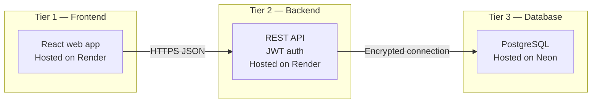
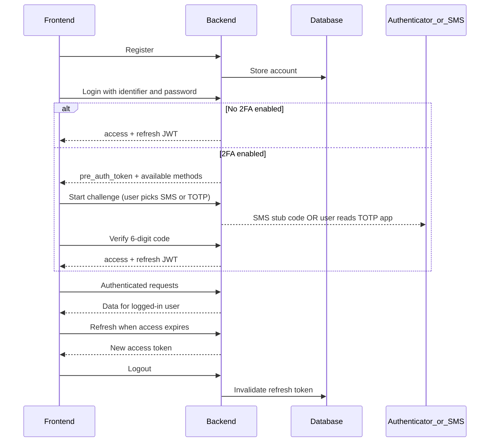
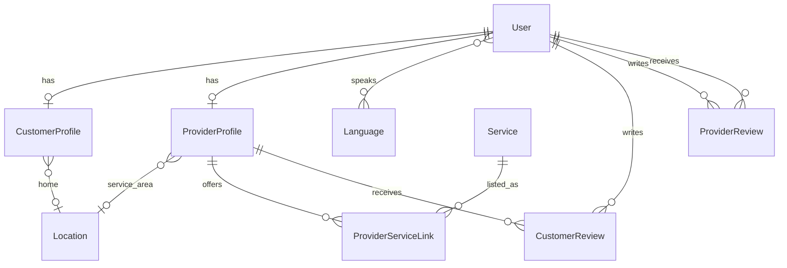

# BitHealth — System Requirements & Design

BitHealth is a platform where **healthcare workers register as providers** and visit **patients at home** for services such as massage therapy, internal medicine, nursing, psychology, and related care. **Customers (patients)** discover providers, book services, and manage their profile and location data through a separate client.

This document describes **what** the system must do and **how the major pieces connect**. It is a design reference for product and engineering—not a code-level specification.

---

## 1. Product summary

| Actor | Role |
|--------|------|
| **Customer** | Patient or family member; books home visits, stores address and preferences, reviews providers. |
| **Provider** | Licensed or certified healthcare worker; offers catalog services in a geographic area, may review customers after visits. |

**Core flows (target)**

1. Provider signs up, completes a public business profile, and selects which catalog services they offer.
2. Customer signs up, records where they live and relevant preferences, browses providers and services, and books a home visit *(booking not yet in scope)*.
3. After a visit, the customer may rate the provider; the provider may rate the customer.

---

## 2. Three-tier architecture

| Tier | Purpose | Hosting |
|------|---------|---------|
| **Frontend** | Accessible UI for customers and providers | Render (static SPA) |
| **Backend** | Business logic, auth, API | Render |
| **Database** | Persistent relational storage | Neon |

**Communication principles**

- The browser talks to the API **only over HTTPS** using **JSON**.
- Authentication is **token-based** (short-lived access token + long-lived refresh token); the API does not rely on server-rendered pages for the app UI.
- The database is **never** reachable from the client; only the backend holds connection credentials.

---

## 3. How frontend and backend work together

### 3.1 Environments

| Environment | Frontend | API |
|-------------|----------|-----|
| Local development | Typical Vite dev port | Local API port |
| Production | Render frontend URL | Render backend URL |

The backend must explicitly allow the frontend origin for cross-origin requests. The frontend should use a single configured API base URL for all calls.

**Current state:** The patient-facing UI largely runs on **mock data**. Wiring it to the live API is the next integration milestone.

### 3.2 Authentication (design)

**Swagger groups:** `auth` (register, login, JWT) and `2FA-auth` (two-factor setup, challenge, password reset).

| Concern | Design choice |
|---------|----------------|
| Login identifier | **Email**, **phone number**, or **CNP/SSN** — single field `identifier` + `password` |
| Phone format | Whitespace stripped on save and lookup (`+40 740 123 193` → `+40740123193`) |
| Roles | **Customer** or **Provider** — drives which screens and actions are available |
| Access token lifetime | Short (on the order of minutes) |
| Refresh token lifetime | Long (on the order of weeks), rotatable and revocable on logout |
| Protected calls | Send access token in the standard authorization header |
| 2FA timing | Enabled **after register** in account settings — not during signup |

Interactive API exploration: **Swagger** at `/api/docs/` (`auth` and `2FA-auth` tags).

### 3.3 Two-factor authentication (frontend integration)

Two independent methods; **both can be enabled**. User **chooses one per login**. This is **not** push-based 2FA (no “approve on phone” notifications).

| Method | Best for | How it works |
|--------|----------|--------------|
| **SMS OTP** | Older users, simpler UX | 6-digit code; dev/stub returns `otp_code` in JSON (no real SMS yet) |
| **TOTP** | Security-conscious users | Google Authenticator (or similar); QR from `provisioning_uri` |

#### API surface (base path `/api/auth/`)

| Step | Method | Path | Auth required? |
|------|--------|------|----------------|
| Register / login / refresh / logout / me | various | `register/`, `login/`, … | login/register: no |
| 2FA status | GET | `2fa/status/` | yes |
| Enable/disable method | POST | `2fa/method/` | yes — body: `{ method: "sms"\|"totp", enabled: true\|false }` |
| TOTP setup | POST | `2fa/totp/setup/` | yes — returns `secret`, `provisioning_uri` |
| TOTP confirm setup | POST | `2fa/totp/confirm/` | yes — body: `{ code: "123456" }` |
| Disable all 2FA | POST | `2fa/disable/` | yes — body: `{ password: "..." }` |
| Login step 1 | POST | `login/` | no |
| Login step 2 — pick method | POST | `2fa/challenge/` | no — `{ pre_auth_token, method }` |
| Login step 3 — SMS | POST | `2fa/sms/verify-login/` | no |
| Login step 3 — TOTP | POST | `2fa/totp/verify-login/` | no |
| Password reset request | POST | `password-reset/request/` | no — `{ phone_number }` |
| Password reset confirm | POST | `password-reset/confirm/` | no — phone + otp + new password |

#### Login flow (frontend state machine)

1. **POST** `login/` with `{ identifier, password }`.
2. If `requires_2fa === false` → store `access` / `refresh`, done.
3. If `requires_2fa === true` → keep `pre_auth_token` in memory; read `available_2fa_methods` (e.g. `["sms","totp"]`).
4. Show method picker (hide options not in the list; if only one method, skip picker).
5. **POST** `2fa/challenge/` with `{ pre_auth_token, method }`.
   - SMS: response may include `otp_code` in dev (stub).
   - TOTP: prompt for code from authenticator app.
6. **POST** `2fa/sms/verify-login/` or `2fa/totp/verify-login/` with `{ pre_auth_token, code }`.
7. Store JWT; clear `pre_auth_token`.

`pre_auth_token` expires in ~5 minutes — on failure, return user to step 1.

#### TOTP setup flow (settings / security screen)

1. **POST** `2fa/totp/setup/` → render QR from `provisioning_uri` (library e.g. qrcode.react).
2. User scans with Google Authenticator.
3. **POST** `2fa/totp/confirm/` with current 6-digit code.
4. **POST** `2fa/method/` with `{ method: "totp", enabled: true }`.
5. **GET** `2fa/status/` to confirm `available_2fa_methods` includes `"totp"`.

#### SMS 2FA setup

Requires `phone_number` on account. **POST** `2fa/method/` with `{ method: "sms", enabled: true }`.

#### Password recovery (separate from login 2FA)

SMS-only today (phone number → OTP → new password). **Not** TOTP. Flow:

1. `password-reset/request/` → `{ phone_number }`
2. User enters OTP (stub: `otp_code` in response in dev)
3. `password-reset/confirm/` → `{ phone_number, otp, new_password }`
4. Redirect to login

#### UI recommendations (accessibility)

- Large inputs for 6-digit codes; optional auto-advance per digit.
- Plain-language labels: “Text me a code” vs “Use authenticator app”.
- TOTP setup: show QR **and** manual secret entry for users who cannot scan.
- Do not rely on QR-only flows for elderly users — offer SMS as default in settings copy.
- Never display CNP in API responses; collect at register only.

### 3.4 Domain data exposed to the client (read path)

Today the API supports **read-only** access to shared domain data under a **core** documentation group:

| Area | What the client can load |
|------|---------------------------|
| **Locations** | Addresses and optional coordinates (home for customers, service area for providers) |
| **Languages** | Supported language list |
| **Customer profiles** | Avatar, bio, home location, linked account summary |
| **Provider profiles** | Display name, bio, service area, active flag, languages spoken |
| **Services** | Catalog entries (name, description, price range, availability flag) |
| **Provider–service links** | Which provider offers which catalog service |
| **Reviews** | Customer→provider and provider→customer ratings (1–10) and comments |

Sensitive national ID numbers **must never** appear in API responses. Passwords are never returned.

**Write operations** (create/update profile, post review, create booking) are **planned** but not yet part of the public API contract.

### 3.5 What the frontend should do

**In place today (UI)**

- Accessible layout: large touch targets, visible focus, high-contrast emergency actions.
- Multi-language UI (several locales in the interface).
- Core patient journeys: dashboard, medications, wellness check-in, emergency flow—still backed by placeholders in many places.

**Expected responsibilities**

1. **Authentication** — Registration; login with email, phone, or CNP; optional 3-step 2FA; logout; silent refresh; route protection by role.
2. **Security settings** — Screens to enable SMS and/or TOTP (post-register); TOTP QR setup; disable 2FA with password confirmation.
3. **Password recovery** — Phone-based OTP flow (stub SMS in dev).
4. **Customer onboarding** — Capture identity, contact details, national ID at signup, home location, spoken languages, and eventual medical context.
5. **Provider onboarding** — Business identity, service area, languages, and which catalog services they deliver.
6. **Discovery** — Browse services and providers; filter by location and language until dedicated search exists.
7. **Accessibility** — **Text-to-speech** on critical content, with non-audio fallback; prefer SMS 2FA as the simpler path in copy for older users.
8. **Resilience** — Handle expired `pre_auth_token` and access tokens; accessible error messages.

---

## 4. Backend requirements

### 4.1 In scope today

- REST API for authentication (register, login with email/phone/CNP, refresh, logout, current user).
- **Dual 2FA:** SMS OTP (stub) and TOTP (Google Authenticator); user chooses method at login when both enabled.
- Password reset via phone SMS OTP (stub).
- Encrypted storage for national ID / CNP at rest; searchable login via one-way hash; hashed passwords.
- Phone whitespace normalization.
- Relational domain model for profiles, services, locations, languages, reviews, and provider–service associations.
- Cross-origin support for the SPA.
- Machine-readable API documentation (Swagger tags: `auth`, `2FA-auth`, `core`).

### 4.2 Full product expectations

- **Privacy:** Encrypt or hash all regulated identifiers and health-related fields; minimize data in logs.
- **Auth:** Token-based SPA flow with refresh rotation and explicit logout.
- **Authorization:** Customers and providers may only perform actions allowed for their role (e.g. only customers submit provider reviews).
- **Validation:** Reject inconsistent data (invalid price ranges, duplicate reviews, provider profile on a customer account).
- **Operations:** Rate limiting, audit trails, and production hardening before public launch.
- **Growth:** Endpoints to create and update profiles, locations, service links, reviews, and **bookings**.

---

## 5. Database requirements

### 5.1 Platform

- **PostgreSQL** on **Neon**, accessed only from the backend over **TLS**.
- **Relational** design with explicit relationships (one-to-one profiles, foreign keys, bridge table for provider–service, join table for user languages).

### 5.2 Conceptual data model

| Entity | Role |
|--------|------|
| **User** | Account: email login, role, contact fields, encrypted national ID |
| **Customer profile** | Optional presentation layer for patients (bio, avatar, home location) |
| **Provider profile** | Public provider identity and service area |
| **Location** | Reusable address / geo record |
| **Language** | Normalized language list; users link to many |
| **Service** | Global catalog with description and min/max price |
| **Provider–service link** | Unique pairing: this provider offers this service |
| **Customer review** | Customer rates a provider (1–10, comment); one per pair |
| **Provider review** | Provider rates a customer (1–10, comment); one per pair |

Support tables exist for framework auth, migrations, and token revocation—these are operational, not product-facing.

### 5.3 Data design principles

- **Normalization:** Avoid repeating language lists or addresses on every row; use shared location and language entities (BCNF-oriented).
- **Single account table** with role; extend via profiles instead of duplicating login rows.
- **Reviews** are about people/providers in general today; future **bookings** should anchor reviews and billing to a specific visit.

### 5.4 Scale and consistency (direction)

| Concern | Direction |
|---------|-----------|
| **Read-heavy traffic** (browsing catalog) | Favor **availability** and cached reads; tolerate slightly stale listings where acceptable |
| **Writes** (signup, booking, payment) | Favor **strong consistency** on the primary database |
| **Growth** | Partition or shard by region or provider when volume requires; use read replicas and caching for catalog |

Exact partitioning and replica strategy should follow measured load—not premature optimization.

### 5.5 Planned entities (not yet modeled)

- **Bookings / appointments** (time, status, assigned provider)
- **Medical records** (documents, allergies, medications—the UI already prototypes some of this)
- **Payments**
- **Notifications and messaging**

---

## 6. Frontend requirements (summary)

| Requirement | Status |
|-------------|--------|
| React SPA deployed on Render | Target |
| Accessibility-first UI (WCAG-oriented) | In progress |
| Text-to-speech for key flows | Planned |
| Multi-language interface | In place (UI); sync with account languages planned |
| Simple onboarding (location, medical context) | Planned |
| Live API integration | In progress (auth + 2FA + read catalog on backend) |
| Role-specific experiences (customer vs provider) | Planned |
| 2FA (SMS + TOTP) settings UI | Planned |
| Login method picker (SMS vs authenticator) | Planned |
| Password recovery (phone OTP) | Planned |

---

## 7. Security and compliance (cross-cutting)

- Secrets and encryption keys only on the server; never in the repository or client bundle.
- HTTPS everywhere in production.
- National ID and health data encrypted at rest; never exposed in read APIs.
- Disable debug features in production.
- Throttle authentication endpoints before public launch.
- Document any key rotation with a re-encryption plan for stored sensitive fields.

---

## 8. Document history

| Version | Focus |
|---------|--------|
| 1.0 | Initial architecture, domain model, and layer responsibilities |
| 1.1 | Refocused as design doc; removed implementation-level naming |
| 1.2 | Login identifiers (email/phone/CNP), dual 2FA flows, frontend integration guide |

For request/response shapes and try-it-out calls, use the backend **Swagger** documentation in deployed or local environments (`auth`, `2FA-auth`, `core` tags).
