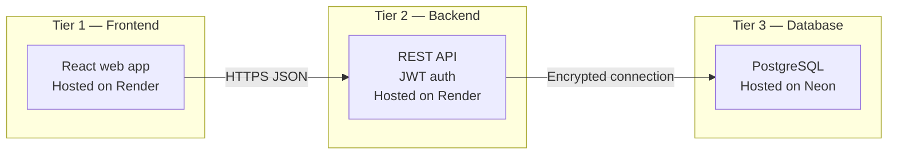
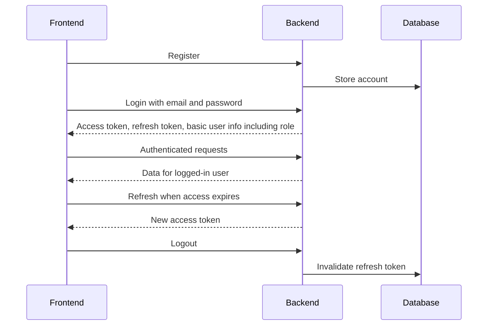
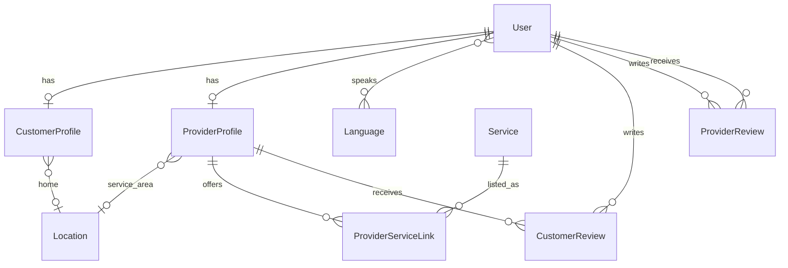

# BitHealth — System Requirements & Design

BitHealth is a platform where **healthcare workers register as providers** and visit **patients at home** for services such as massage therapy, internal medicine, nursing, psychology, and related care. **Customers (patients)** discover providers, book services, and manage their profile and location data through a separate client.

This document describes **what** the system must do and **how the major pieces connect**. It is a design reference for product and engineering—not a code-level specification.

---

## 1. Product summary

| Actor | Role |
|--------|------|
| **Customer** | Patient or family member; books home visits, stores address and preferences, reviews providers. |
| **Provider** | Licensed or certified healthcare worker; offers catalog services in a geographic area, may review customers after visits. |

**Core flows (target)**

1. Provider signs up, completes a public business profile, and selects which catalog services they offer.
2. Customer signs up, records where they live and relevant preferences, browses providers and services, and books a home visit *(booking not yet in scope)*.
3. After a visit, the customer may rate the provider; the provider may rate the customer.

---

## 2. Three-tier architecture

| Tier | Purpose | Hosting |
|------|---------|---------|
| **Frontend** | Accessible UI for customers and providers | Render (static SPA) |
| **Backend** | Business logic, auth, API | Render |
| **Database** | Persistent relational storage | Neon |

**Communication principles**

- The browser talks to the API **only over HTTPS** using **JSON**.
- Authentication is **token-based** (short-lived access token + long-lived refresh token); the API does not rely on server-rendered pages for the app UI.
- The database is **never** reachable from the client; only the backend holds connection credentials.

---

## 3. How frontend and backend work together

### 3.1 Environments

| Environment | Frontend | API |
|-------------|----------|-----|
| Local development | Typical Vite dev port | Local API port |
| Production | Render frontend URL | Render backend URL |

The backend must explicitly allow the frontend origin for cross-origin requests. The frontend should use a single configured API base URL for all calls.

**Current state:** The patient-facing UI largely runs on **mock data**. Wiring it to the live API is the next integration milestone.

### 3.2 Authentication (design)

| Concern | Design choice |
|---------|----------------|
| Login identifier | Email (no separate username) |
| Roles | **Customer** or **Provider** — drives which screens and actions are available |
| Access token lifetime | Short (on the order of minutes) |
| Refresh token lifetime | Long (on the order of weeks), rotatable and revocable on logout |
| Protected calls | Send access token in the standard authorization header |

Interactive API exploration is available via **Swagger** on the backend (auth and domain resources grouped for readability).

### 3.3 Domain data exposed to the client (read path)

Today the API supports **read-only** access to shared domain data under a **core** documentation group:

| Area | What the client can load |
|------|---------------------------|
| **Locations** | Addresses and optional coordinates (home for customers, service area for providers) |
| **Languages** | Supported language list |
| **Customer profiles** | Avatar, bio, home location, linked account summary |
| **Provider profiles** | Display name, bio, service area, active flag, languages spoken |
| **Services** | Catalog entries (name, description, price range, availability flag) |
| **Provider–service links** | Which provider offers which catalog service |
| **Reviews** | Customer→provider and provider→customer ratings (1–10) and comments |

Sensitive national ID numbers **must never** appear in API responses. Passwords are never returned.

**Write operations** (create/update profile, post review, create booking) are **planned** but not yet part of the public API contract.

### 3.4 What the frontend should do

**In place today (UI)**

- Accessible layout: large touch targets, visible focus, high-contrast emergency actions.
- Multi-language UI (several locales in the interface).
- Core patient journeys: dashboard, medications, wellness check-in, emergency flow—still backed by placeholders in many places.

**Expected responsibilities**

1. **Authentication** — Registration, login, logout, silent refresh, and route protection by role.
2. **Customer onboarding** — Capture identity, contact details, encrypted national ID at signup, home location, spoken languages, and eventual medical context (allergies, medications, history).
3. **Provider onboarding** — Business identity, service area, languages, and which catalog services they deliver.
4. **Discovery** — Browse services and providers; filter by location and language until dedicated search exists.
5. **Accessibility** — **Text-to-speech** on critical content (medication reminders, navigation, emergency confirmation), with a non-audio fallback for users who disable speech or motion.
6. **Resilience** — Clear handling of expired sessions and server errors without losing user context.

---

## 4. Backend requirements

### 4.1 In scope today

- REST API for authentication (register, login, refresh, logout, current user).
- Encrypted storage for national ID / CNP at rest; hashed passwords.
- Relational domain model for profiles, services, locations, languages, reviews, and provider–service associations.
- Cross-origin support for the SPA.
- Machine-readable API documentation for integrators.

### 4.2 Full product expectations

- **Privacy:** Encrypt or hash all regulated identifiers and health-related fields; minimize data in logs.
- **Auth:** Token-based SPA flow with refresh rotation and explicit logout.
- **Authorization:** Customers and providers may only perform actions allowed for their role (e.g. only customers submit provider reviews).
- **Validation:** Reject inconsistent data (invalid price ranges, duplicate reviews, provider profile on a customer account).
- **Operations:** Rate limiting, audit trails, and production hardening before public launch.
- **Growth:** Endpoints to create and update profiles, locations, service links, reviews, and **bookings**.

---

## 5. Database requirements

### 5.1 Platform

- **PostgreSQL** on **Neon**, accessed only from the backend over **TLS**.
- **Relational** design with explicit relationships (one-to-one profiles, foreign keys, bridge table for provider–service, join table for user languages).

### 5.2 Conceptual data model

| Entity | Role |
|--------|------|
| **User** | Account: email login, role, contact fields, encrypted national ID |
| **Customer profile** | Optional presentation layer for patients (bio, avatar, home location) |
| **Provider profile** | Public provider identity and service area |
| **Location** | Reusable address / geo record |
| **Language** | Normalized language list; users link to many |
| **Service** | Global catalog with description and min/max price |
| **Provider–service link** | Unique pairing: this provider offers this service |
| **Customer review** | Customer rates a provider (1–10, comment); one per pair |
| **Provider review** | Provider rates a customer (1–10, comment); one per pair |

Support tables exist for framework auth, migrations, and token revocation—these are operational, not product-facing.

### 5.3 Data design principles

- **Normalization:** Avoid repeating language lists or addresses on every row; use shared location and language entities (BCNF-oriented).
- **Single account table** with role; extend via profiles instead of duplicating login rows.
- **Reviews** are about people/providers in general today; future **bookings** should anchor reviews and billing to a specific visit.

### 5.4 Scale and consistency (direction)

| Concern | Direction |
|---------|-----------|
| **Read-heavy traffic** (browsing catalog) | Favor **availability** and cached reads; tolerate slightly stale listings where acceptable |
| **Writes** (signup, booking, payment) | Favor **strong consistency** on the primary database |
| **Growth** | Partition or shard by region or provider when volume requires; use read replicas and caching for catalog |

Exact partitioning and replica strategy should follow measured load—not premature optimization.

### 5.5 Planned entities (not yet modeled)

- **Bookings / appointments** (time, status, assigned provider)
- **Medical records** (documents, allergies, medications—the UI already prototypes some of this)
- **Payments**
- **Notifications and messaging**

---

## 6. Frontend requirements (summary)

| Requirement | Status |
|-------------|--------|
| React SPA deployed on Render | Target |
| Accessibility-first UI (WCAG-oriented) | In progress |
| Text-to-speech for key flows | Planned |
| Multi-language interface | In place (UI); sync with account languages planned |
| Simple onboarding (location, medical context) | Planned |
| Live API integration | Planned (auth and read catalog ready on backend) |
| Role-specific experiences (customer vs provider) | Planned |

---

## 7. Security and compliance (cross-cutting)

- Secrets and encryption keys only on the server; never in the repository or client bundle.
- HTTPS everywhere in production.
- National ID and health data encrypted at rest; never exposed in read APIs.
- Disable debug features in production.
- Throttle authentication endpoints before public launch.
- Document any key rotation with a re-encryption plan for stored sensitive fields.

---

## 8. Document history

| Version | Focus |
|---------|--------|
| 1.0 | Initial architecture, domain model, and layer responsibilities |
| 1.1 | Refocused as design doc; removed implementation-level naming |

For request/response shapes and try-it-out calls, use the backend **Swagger** documentation in deployed or local environments.
